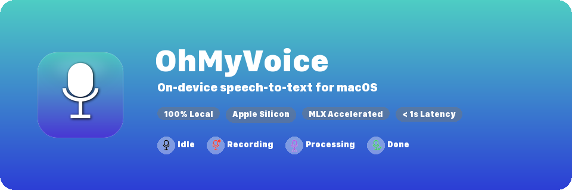

<p align="center">
  
</p>

<p align="center">
  <b>按住快捷键说话，松手即得文字。</b><br>
  100% 本地运行，不联网，不上传，亚秒级延迟。
</p>

---

## Why OhMyVoice

| | 云端方案 | OhMyVoice |
|---|---|---|
| 隐私 | 音频上传第三方服务器 | 音频不出本机 |
| 延迟 | 网络往返 + 排队 | Metal GPU 直接推理 |
| 离线 | 断网不可用 | 完全离线工作 |
| 费用 | 按量付费 | 免费，无限使用 |

## How It Works

```
⌥ Space (按住)  →  录音  →  松手  →  MLX 推理  →  文字写入剪贴板
```

底层模型是 [Qwen3-ASR-0.6B](https://huggingface.co/Qwen/Qwen3-ASR-0.6B)，通过 [MLX](https://github.com/ml-explore/mlx) 在 Apple Silicon GPU 上做 4-bit 量化推理。0.6B 参数量保证了极低延迟，中英文混合识别准确率高。

首次启动自动下载模型（~600MB），之后完全离线。

## Quick Start

**要求：** macOS 14+, Apple Silicon (M1/M2/M3/M4), Python 3.11+

```bash
git clone https://github.com/forbidden-game/ohmyvoice.git
cd ohmyvoice

# 安装依赖
pip install -e .

# 编译 SwiftUI 组件
make build

# 启动
make run
```

菜单栏出现麦克风图标即就绪。按住 `⌥ Space` 说话，松手后文字自动复制到剪贴板。

## Architecture

```
┌─ Menu Bar (rumps) ──────────────────────────┐
│  Python 主进程                                │
│  ├── HotkeyManager (CGEventTap)             │
│  ├── Recorder (sounddevice)                  │
│  ├── ASREngine (mlx-qwen3-asr, 4-bit)      │
│  └── UIBridge ──stdin/stdout JSON──→ SwiftUI │
│                                    (设置/历史) │
└──────────────────────────────────────────────┘
```

Python 负责核心逻辑（热键监听、录音、推理、剪贴板），SwiftUI 子进程负责原生窗口（设置面板、历史记录）。两者通过 JSON over stdio 通信。

## Build & Distribute

```bash
# 构建 .app bundle（无签名，本地测试用）
make dist

# 完整流水线：构建 → 签名 → 公证 → DMG
# 需要设置环境变量：DEVELOPER_ID_APPLICATION, APPLE_ID, APPLE_TEAM_ID, APP_PASSWORD
make dmg
```

## License

MIT
